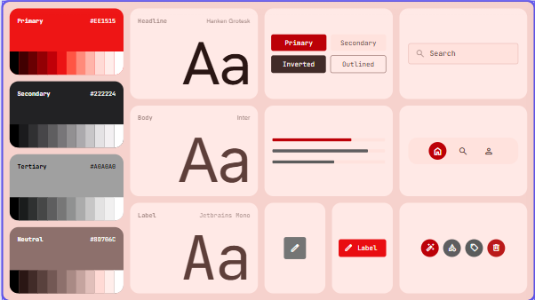
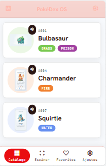
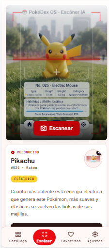
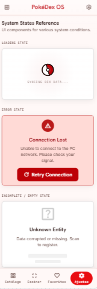
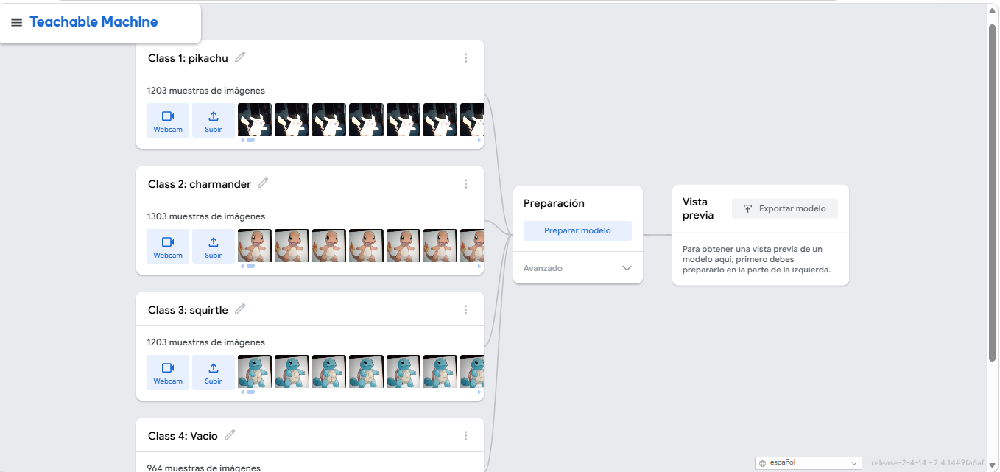
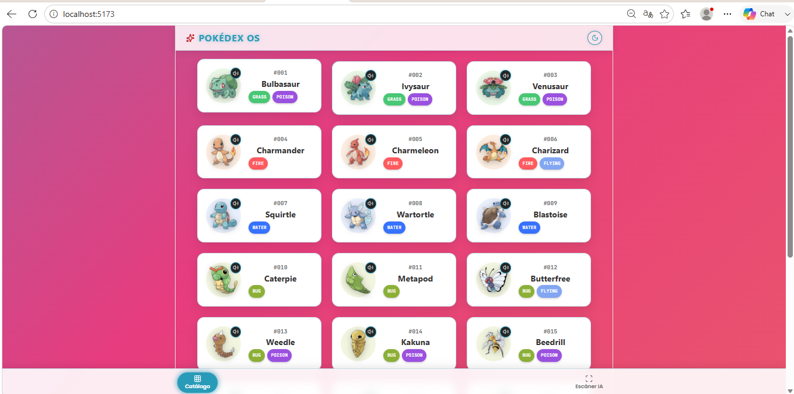
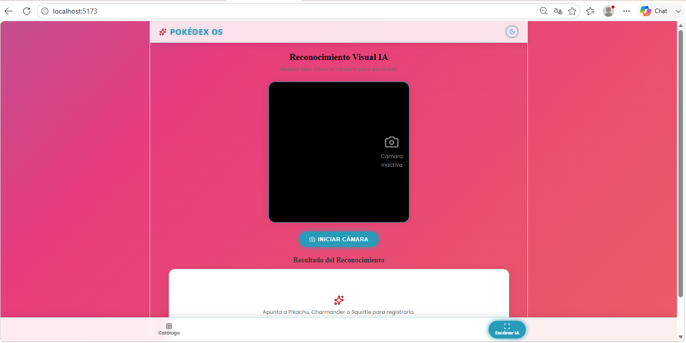

# PokéDex OS — Catálogo Web y Reconocimiento Visual con IA

## 👤 Información del Estudiante
- **Nombre del proyecto:** PokéDex OS
- **Nombre del estudiante:** Ángel Armando Martínez Sánchez
- **Tecnología asignada:** React (Vite)
- **Biblioteca/Framework de visión artificial:** `@teachablemachine/image` (TensorFlow.js)
- **Pokémon reconocibles por el modelo:** Pikachu, Charmander, Squirtle

---

## 🔗 Enlaces del Proyecto y Evidencias
- **Despliegue en Producción (Vercel):** [Pega aquí tu enlace generado por Vercel]
- **Repositorio de Código (GitHub):** [Pega aquí el enlace de tu repositorio de GitHub]
- **Diseño en Google Stitch:** [Pega aquí el enlace público de tu prototipo en Google Stitch]
- **Modelo de Visión Entrenado (Teachable Machine):** `https://teachablemachine.withgoogle.com/models/wewjrhGxi/`

---

## 🛠️ Herramientas de Inteligencia Artificial Utilizadas
1. **Google Stitch:** Conceptualización y prototipado visual de la interfaz de usuario (guía de estilos, vistas del Catálogo y Escáner IA, y componentes de estado del sistema: Loading, Error y Empty state).
2. **Teachable Machine (Google):** Preparación del dataset con más de 900 a 1300 muestras por clase, entrenamiento y exportación del modelo de visión artificial basado en redes neuronales convolucionales con 4 clases (`pikachu`, `charmander`, `squirtle` y `vacio`).
3. **Gemini:** Asistencia en la arquitectura de componentes de React, optimización de peticiones asíncronas paralelas a la PokéAPI (`Promise.all`), control de inferencia con `useRef` para prevenir saturación de red y desarrollo del sistema de temas (Light/Dark mode) con degradado dinámico fluido.

---

## ⚙️ Instrucciones de Instalación y Ejecución Local

### Requisitos Previos
- Node.js versión 18.0.0 o superior instalada.
- Navegador web moderno (Chrome, Edge, Brave o Firefox) con soporte para WebRTC (acceso a cámara web) y Web Audio API.

### 1. Clonación del Repositorio
```bash
git clone [URL-DE-TU-REPOSITORIO]
cd pokedex-pro

### 2. Instalación de Dependencias
npm install

### 3. Ejecución del Servidor de Desarrollo
npm run dev

## 📋 Checklist de Evidencias de Funcionamiento

- **Catálogo de Pokémon:** Consulta dinámica asíncrona a la PokéAPI sin datos manuales en el código, presentando especímenes en tarjetas horizontales con su número de Pokédex (`#001`), nombre, tipos temáticos e imagen oficial en alta resolución (`official-artwork`).
- **Reproducción de Sonido Interactiva:** Cada tarjeta cuenta con un control interactivo que reproduce el grito oficial (*cry*) del Pokémon vía Web Audio API sin reproducirse automáticamente al cargar.
- **Diseño Adaptable (Responsive) y Temas:** Interfaz completamente adaptable a pantallas de escritorio y dispositivos móviles, con barra de navegación inferior (`BottomNavBar`) y alternador de tema Modo Día / Modo Noche con degradado animado continuo (`gradientFlow`).
- **Reconocimiento Visual mediante Cámara:** Vista dedicada que solicita permisos de cámara, ejecuta inferencia en tiempo real a través del modelo de Teachable Machine, muestra barras de porcentaje de confianza en vivo y, tras superar el 60% de certeza, consulta automáticamente la PokéAPI para mostrar la tarjeta correspondiente sin saturar la red.

---

## 🎓 Guía

| **"Ejecuta el proyecto desde cero"** | Terminal | Ejecutar `npm install` para restaurar dependencias y posteriormente `npm run dev`. |
| **"¿Dónde y cómo se consulta la PokéAPI?"** | `src/services/pokeApi.js` | La función `getPokemonList()` consulta inicialmente el endpoint `/pokemon?limit=24`. Luego, mapea cada resultado con `getPokemonDetails()` usando `Promise.all()` para resolver en paralelo los datos detallados (imágenes oficiales, cries y tipos). |
| **"Muéstrame cómo manejas los errores de red"** | `src/pages/CatalogPage.jsx` | Se implementa un bloque `try/catch` que captura excepciones de red y activa el estado reactivo `error`, renderizando una tarjeta de advertencia visual con el botón de reintento (`Retry Connection`). |
| **"Cambia la cantidad de Pokémon mostrados a 12 o 48"** | `src/pages/CatalogPage.jsx` | En la función `fetchCatalog`, se modifica el argumento numérico en `getPokemonList(12)` o `getPokemonList(48)`. |
| **"¿Cómo evitas saturar la PokéAPI con llamadas continuas en la cámara?"** | `src/pages/ScannerPage.jsx` | Se utiliza la referencia mutable `lastDetectedRef`. Aunque el bucle de predicción analiza fotogramas a 60 FPS con `requestAnimationFrame`, solo se ejecuta `fetchScannedPokemon()` si el Pokémon detectado con más del 60% de certeza es distinto al guardado en `lastDetectedRef.current`. |
| **"Demuestra el reconocimiento de los 3 Pokémon"** | Pestaña **Escáner IA** | Se inicia la cámara y se muestra frente al lente una imagen o figura de Pikachu, Charmander y Squirtle de forma consecutiva, verificando que la interfaz cambie la tarjeta y descargue el sonido correspondiente. |

## 🎨 1. Evidencias de Diseño en Google Stitch

Propuesta visual y maquetación inicial exportada desde Google Stitch:

| Guía de Estilos y UI Kits | Prototipo del Catálogo |
| :---: | :---: |
|  |  |

| Prototipo Escáner IA | Estados del Sistema (Loading / Error / Empty) |
| :---: | :---: |
|  |  |

---

## 🧠 2. Dataset y Entrenamiento de Visión Computacional

Dataset entrenado en **Teachable Machine (Google)** con más de 900 a 1300 muestras fotográficas por clase:

<p align="center">
  
</p>

* **Clase 1 (Pikachu):** 1,203 muestras.
* **Clase 2 (Charmander):** 1,303 muestras.
* **Clase 3 (Squirtle):** 1,203 muestras.
* **Clase 4 (Vacío / Fondo):** 964 muestras de descarte.

---

## 🚀 3. Evidencias de la Aplicación en Ejecución (React + Vite)

Capturas de la aplicación web consumiendo la PokéAPI con el fondo dinámico `gradientFlow` y soporte Dark/Light mode:

### Catálogo Nacional (Consumo de PokéAPI)
<p align="center">
  
</p>

### Escáner IA (Módulo de Visión Artificial)
<p align="center">
  
</p>